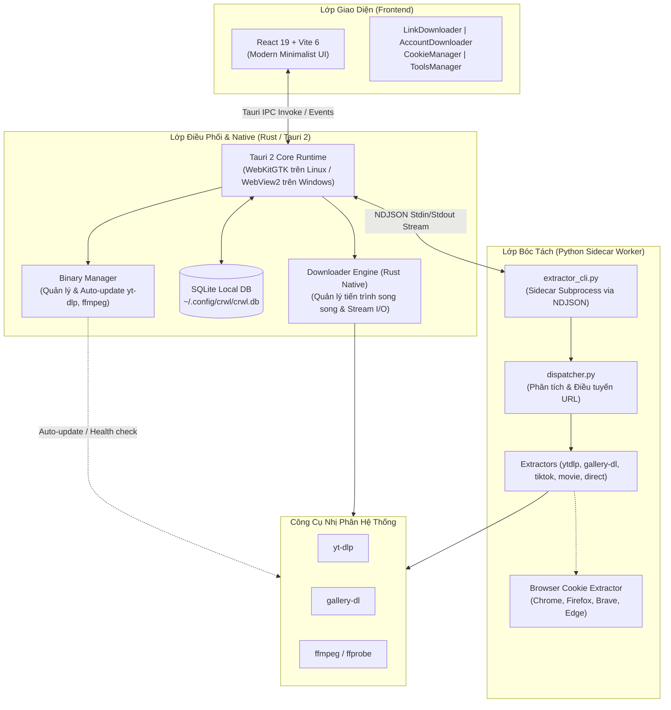

# ⚡ Social Media Crawler & Downloader

<div align="center">


**Ứng dụng Desktop Native hiệu năng cao, bảo mật và tôn trọng quyền riêng tư — hỗ trợ bóc tách, tải video 4K/8K, âm thanh và album ảnh hàng loạt từ mọi mạng xã hội phổ biến.**

[Tính Năng](#-tính-năng-nổi-bật) • [Mục Đích Dự Án](#-mục-đích-dự-án--triết-lý-kiến-trúc) • [Kiến Trúc](#-kiến-trúc-hệ-thống) • [Cài Đặt & Chạy](#-hướng-dẫn-cài-đặt--chạy-ứng-dụng) • [Cách Debug](#-cẩm-nang-debug--xử-lý-sự-cố) • [Đóng Gói](#-hướng-dẫn-đóng-gói-build-release)

</div>

---

## 📖 Giới Thiệu Dự Án

**Social Media Crawler** (`crwl-on-socialmedia`) là ứng dụng Desktop Native thế hệ mới được thiết kế theo mô hình **Tauri 2 (Rust) + React 19 + Python Engine Sidecar**.

Ứng dụng cho phép người dùng bóc tách thông tin và tải xuống các nội dung đa phương tiện (Video sắc nét đến 4K/8K, Audio/MP3 chất lượng cao, Album ảnh đa hình/Carousel, Phụ đề, Thumbnail) từ các nền tảng truyền thông phổ biến:

| Nền tảng | Nội dung hỗ trợ | Định dạng trích xuất |
| :--- | :--- | :--- |
| **YouTube** | Video, Shorts, Music, Playlist | 8K/4K/1080p, MP3/M4A, Subtitles, Thumbnail |
| **TikTok / Douyin** | Video, Slideshow/Photo post, Âm thanh gốc | Video No-Watermark (HD), Zip ảnh, Audio MP3 |
| **Facebook** | Reels, Watch Video, Public Post | Full HD / HD / SD, Audio |
| **Instagram** | Reels, Posts, Carousel Album, Stories | Video gốc, Ảnh phân giải cao, Zip trọn bộ |
| **Twitter / X** | Video tweets, GIF, Multi-image posts | Đa phân giải (1080p, 720p), Ảnh JPG/PNG |
| **Khác** | Pinterest, Reddit, SoundCloud, Bilibili, HLS (`.m3u8`) | Tự động phát hiện qua intelligent resolver |

---

## 🎯 Mục Đích Dự Án & Triết Lý Kiến Trúc

### 1. Tại sao chuyển từ Web Scraper truyền thống sang Desktop Native?

Các dịch vụ web crawler/downloader chạy trên máy chủ tập trung (VPS/Cloud) thường đối mặt với các vấn đề nan giải:

1. **Nguy cơ IP Blacklist:** Các dải IP Datacenter của AWS, DigitalOcean, Hetzner rất dễ bị TikTok, YouTube hay Cloudflare nhận diện bot và chặn IP hoặc bắt giải Captcha liên tục.
2. **Chi phí băng thông kép (Double Bandwidth):** Server phải tải video về rồi mới truyền lại (stream) cho người dùng, gây tốn tài nguyên và tăng độ trễ.
3. **Bảo mật và Quyền riêng tư:** Người dùng e ngại việc chia sẻ lịch sử tải, tài khoản hoặc cookie lên một máy chủ từ xa.

### 2. Giải pháp của Social Media Crawler

* 🌐 **Sử dụng Residential IP:** Tận dụng trực tiếp đường truyền mạng dân cư của máy tính người dùng, giảm thiểu 99% khả năng bị chặn rate-limit hoặc xác minh bot.
* ⚡ **Ghi File Trực Tiếp (Zero Server Cost):** Tải và ghép luồng âm thanh/hình ảnh trực tiếp vào ổ cứng (`~/Downloads`), tốc độ đạt tối đa theo băng thông mạng của máy.
* 🔒 **Bảo Mật Tuyệt Đối & Offline-First:** Sử dụng cơ sở dữ liệu **SQLite nhúng cục bộ** (`~/.config/crwl/crwl.db`). Toàn bộ lịch sử tải, cấu hình và cookie được lưu trữ 100% trên máy tính của bạn, không gửi bất kỳ thông tin nào ra ngoài.
* 🛡️ **Kiến trúc Cô lập Subprocess (Sidecar):** Engine bóc tách Python chạy độc lập dưới dạng Sidecar IPC, nếu trang web thay đổi thuật toán thì app vẫn hoạt động an toàn và không bị crash.

---

## 🏗️ Kiến Trúc Hệ Thống

Dự án áp dụng mô hình phân tách 3 lớp rõ ràng (**Mô hình Tam Giác Vàng**):



---

## ✨ Tính Năng Nổi Bật

- [x] **Link Downloader (Đơn & Đa liên kết):** Dán link video/ảnh bất kỳ, tự động nhận diện nền tảng, cho phép chọn chất lượng (4K, 1080p, 720p, chỉ Audio MP3, Thumbnail, Subtitle).
- [x] **Account / Profile Crawler:** Cào toàn bộ video hoặc bài viết từ trang cá nhân (@username), tải danh sách hoặc nén gói ZIP tiện lợi.
- [x] **Cookie Manager Thông Minh:** Tự động đọc cookie sạch từ các trình duyệt đã cài đặt (Chrome, Brave, Firefox, Edge, Chromium) hoặc nhập file `cookies.txt` để tải nội dung riêng tư / giới hạn độ tuổi.
- [x] **Quản Lý Bộ Công Cụ (Tools Manager):** Kiểm tra phiên bản và **cập nhật `yt-dlp` chỉ bằng 1 cú click** ngay trong giao diện ứng dụng.
- [x] **Quản Lý Tiến Trình Thời Gian Thực:** Hiển thị phần trăm tải, tốc độ (MB/s), dung lượng và thời gian còn lại. Hỗ trợ tạm dừng, hủy và mở thư mục lưu file tức thì.
- [x] **Lịch Sử Tải & Thống Kê:** Lưu trữ nhật ký đầy đủ qua SQLite cục bộ, hỗ trợ tìm kiếm, lọc theo nền tảng và dọn dẹp lịch sử.

---

## 💻 Yêu Cầu Môi Trường (Prerequisites)

Trước khi chạy hoặc build dự án, hãy đảm bảo máy tính đã cài đặt:

| Công cụ | Phiên bản yêu cầu | Ghi chú |
| :--- | :--- | :--- |
| **Node.js** | `>= 22.12.0` | Khuyên dùng bản LTS mới nhất |
| **pnpm** | `>= 9.15.5` | Package manager chính thức của repo |
| **Rust & Cargo** | `Stable (>= 1.77)` | Trình biên dịch mã nguồn Tauri |
| **Python** | `>= 3.10` | Lõi xử lý bóc tách sidecar |
| **FFmpeg** | Bản mới nhất | Ghép luồng âm thanh/hình ảnh & trích xuất MP3 |

### Cài đặt thư viện hệ thống cần thiết (Dành cho Linux):

#### Ubuntu / Debian / Linux Mint:
```bash
sudo apt update
sudo apt install -y \
  build-essential curl wget file \
  libssl-dev libgtk-3-dev libwebkit2gtk-4.1-dev \
  libayatana-appindicator3-dev librsvg2-dev libxdo-dev \
  python3 python3-pip python3-venv ffmpeg
```

#### Fedora / RHEL:
```bash
sudo dnf install \
  gcc gcc-c++ curl wget file openssl-devel \
  webkit2gtk4.1-devel libappindicator-gtk3-devel librsvg2-devel \
  python3 python3-pip ffmpeg
```

#### Arch Linux / Manjaro:
```bash
sudo pacman -S --needed \
  base-devel curl wget openssl webkit2gtk-4.1 \
  libappindicator-gtk3 librsvg python python-pip ffmpeg
```

---

## 🚀 Hướng Dẫn Cài Đặt & Chạy Ứng Dụng

### Bước 1: Clone kho mã nguồn & Cài đặt dependencies

```bash
# 1. Clone repository
git clone https://github.com/your-username/crwl-on-socialmedia.git
cd crwl-on-socialmedia

# 2. Cài đặt các package Node.js qua pnpm
pnpm install

# 3. Cài đặt các thư viện Python cho lõi engine
pip install --upgrade yt-dlp curl_cffi requests gallery-dl
```

---

### Bước 2: Các chế độ chạy ứng dụng (Development)

Dự án hỗ trợ 3 chế độ chạy tùy vào nhu cầu làm việc:

#### 🟢 Cách 1: Chạy Full Ứng Dụng Desktop Native (Khuyên dùng khi Dev)
Chạy cửa sổ ứng dụng Desktop hoàn chỉnh với tính năng Hot-Reload (HMR) cho cả React UI và Rust backend:

```bash
pnpm dev:tauri
# Hoặc: pnpm --filter desktop tauri dev
```

> **Quy trình hoạt động ngầm:**
> 1. Vite kích hoạt dev server tại `http://localhost:5173`.
> 2. Rust khởi tạo SQLite cục bộ tại `~/.config/crwl/crwl.db`.
> 3. Kích hoạt Python Sidecar Worker (`core/extractor_cli.py`).
> 4. Cửa sổ Desktop WebKitGTK mở lên và sẵn sàng thao tác.

#### 🟡 Cách 2: Chạy Preview Giao Diện Web trên Trình duyệt
Dành riêng cho việc chỉnh sửa giao diện React, tinh chỉnh CSS/layout mà không cần biên dịch Rust:

```bash
pnpm dev
# Mở trình duyệt tại: http://localhost:5173
```
*(Lưu ý: Môi trường web thuần không có Tauri IPC, các tác vụ gọi native như tải file thật hay mở thư mục hệ thống sẽ bị vô hiệu).*

#### 🔵 Cách 3: Kiểm thử & Chạy độc lập Lõi Python Engine
Dành cho việc kiểm thử bóc tách link, viết extractor mới hoặc debug thuật toán mà không cần mở giao diện:

```bash
# 1. Chạy bộ kiểm thử toàn diện hệ thống:
pnpm test:core
# Hoặc: python3 scripts/test_desktop_system.py

# 2. Thử bóc tách một liên kết bất kỳ:
python3 core/extractor_cli.py "https://www.youtube.com/watch?v=dQw4w9WgXcQ" --json

# 3. Quét toàn bộ kênh/profile:
python3 core/extractor_cli.py "@username" --platform tiktok --type profile --limit 10 --json
```

---

## 🐞 Cẩm Nang Debug & Xử Lý Sự Cố

Hệ thống được cấu thành từ 3 thành phần chính: **Frontend**, **Rust Host Core** và **Python Sidecar**. Dưới đây là phương pháp debug chi tiết cho từng tầng:

### 1. Debug Giao Diện Frontend (React / Vite)
- **Mở DevTools trong Desktop App:**
  - Nhấn phím `F12` hoặc nhấp chuột phải vào bất kỳ đâu trên giao diện và chọn **Inspect Element**.
  - Kiểm tra tab **Console** để theo dõi các lỗi JavaScript, các sự kiện Tauri IPC được bắn đi (`invoke`).
  - Kiểm tra tab **Network** để xem các request tải ảnh preview/thumbnail.

### 2. Debug Backend Rust & Tauri IPC
- **Bật chi tiết Log trong Terminal:**
  Chạy lệnh với biến môi trường `RUST_LOG` và `RUST_BACKTRACE`:
  ```bash
  RUST_LOG=debug RUST_BACKTRACE=1 pnpm dev:tauri
  ```
- **Kiểm tra File Log của Ứng Dụng:**
  Ứng dụng tích hợp `tauri-plugin-log`, toàn bộ log hệ thống được ghi lại tại:
  - **Linux:** `~/.config/crwl/logs/` hoặc xuất thẳng ra terminal `stderr`.
  - **Windows:** `%APPDATA%/crwl/logs/`.

### 3. Debug Lõi Bóc Tách Python Engine (Sidecar IPC)
- **Kiểm tra trạng thái Sidecar từ ứng dụng:**
  Ứng dụng có Tauri Command `get_sidecar_status` và `restart_sidecar` để theo dõi tiến trình Python đang chạy ngầm.
- **Tự chạy kiểm tra luồng NDJSON:**
  Mở terminal và gọi trực tiếp `extractor_cli.py` với cờ `--ipc-stream` để kiểm tra luồng dữ liệu chuẩn mà Rust nhận được:
  ```bash
  python3 core/extractor_cli.py --ipc-stream
  # Sau đó gửi JSON request qua stdin:
  {"id": "req-1", "action": "extract", "url": "https://youtu.be/dQw4w9WgXcQ"}
  ```
- **Kiểm tra ngoại lệ (Exceptions):** Nếu một extractor bị lỗi do trang web đổi cấu trúc HTML, chạy trực tiếp URL đó qua lệnh CLI sẽ in ra đầy đủ Python Traceback để xác định vị trí lỗi ngay lập tức.

### 4. Debug Cơ Sở Dữ Liệu SQLite Cục Bộ
- Vị trí cơ sở dữ liệu:
  - **Linux:** `~/.config/crwl/crwl.db`
  - **Windows:** `%APPDATA%/crwl/crwl.db`
- Tra cứu nhanh qua CLI:
  ```bash
  sqlite3 ~/.config/crwl/crwl.db "SELECT id, media_title, platform, status, file_size_bytes FROM download_history ORDER BY id DESC LIMIT 5;"
  ```
- Hoặc mở file bằng các phần mềm GUI như **DBeaver**, **DB Browser for SQLite** hoặc extension **SQLite Viewer** trong VS Code.

### 5. Xử Lý Các Sự Cố Thường Gặp (FAQ)

| Triệu chứng lỗi | Nguyên nhân | Giải pháp |
| :--- | :--- | :--- |
| `failed to run 'pkg-config' ... webkit2gtk-4.1` | Thiếu thư viện đồ họa WebKitGTK trên Linux | Chạy: `sudo apt install libwebkit2gtk-4.1-dev libgtk-3-dev` |
| `invoke is not defined` | Chạy trên trình duyệt thường thay vì Desktop | Dùng lệnh `pnpm dev:tauri` để mở app desktop |
| `yt-dlp: command not found` | Chưa cài đặt hoặc chưa nhận binary trong PATH | Cài đặt: `pip install -U yt-dlp` hoặc dùng tính năng **Tools Manager** trong app |
| Video tải về bị mất tiếng | Thiếu bộ giải mã FFmpeg | Cài đặt: `sudo apt install ffmpeg` |
| YouTube yêu cầu n-sig challenge | Thuật toán YouTube cập nhật mới | Mở **Tools Manager** bấm **Cập nhật yt-dlp** lên bản phát hành mới nhất |

---

## 📦 Hướng Dẫn Đóng Gói (Build Release)

Khi hoàn thiện các tính năng và muốn đóng gói file cài đặt để sử dụng hoặc phát hành:

```bash
# Đóng gói toàn bộ ứng dụng thành bộ cài đặt hoàn chỉnh:
pnpm build:tauri
# Hoặc: pnpm --filter desktop tauri build
```

Quá trình build tự động thực hiện:
1. Build frontend React thành các tệp tĩnh tối ưu tại `apps/desktop/dist/`.
2. Biên dịch mã nguồn Rust ở chế độ `--release` (`opt-level = 3`, `lto`, `strip = true`).
3. Đóng gói mã nguồn `core/` (Python Engine) vào thư mục `resources` của bundle.
4. Tạo bộ cài tương ứng với hệ điều hành:

### 📍 Thư mục chứa file cài đặt sau khi build:
- **Gói Debian/Ubuntu (`.deb`)**:
  `apps/desktop/src-tauri/target/release/bundle/deb/social-media-crawler_0.1.7_amd64.deb`
- **Gói Chạy Nhanh Độc Lập (`.AppImage`)**:
  `apps/desktop/src-tauri/target/release/bundle/appimage/social-media-crawler_0.1.7_amd64.AppImage`
- **Bộ cài Windows (`.exe` / `.msi`)**:
  `apps/desktop/src-tauri/target/release/bundle/nsis/social-media-crawler_0.1.7_x64-setup.exe`

---

## ⚡ Bảng Tra Cứu Lệnh Nhanh (Cheatsheet)

| Lệnh | Chức năng |
| :--- | :--- |
| `pnpm dev:tauri` | Khởi động toàn bộ ứng dụng Desktop (Hot-Reload) |
| `pnpm dev` | Chạy giao diện Web Preview tại `http://localhost:5173` |
| `pnpm build:tauri` | Đóng gói bộ cài Desktop (.deb, .AppImage, .exe) |
| `pnpm test:core` | Chạy bộ kiểm thử tự động của engine Python |
| `pnpm lint` | Kiểm tra cú pháp và định dạng mã nguồn ESLint |
| `cargo test --manifest-path apps/desktop/src-tauri/Cargo.toml` | Chạy unit test của tầng Rust |

---

## 📄 Bản Quyền & Giấy Phép (License)

Dự án được phân phối dưới giấy phép **ISC License**. Xem thêm chi tiết trong mã nguồn.

---

<div align="center">
  <sub>Được phát triển với tinh thần mã nguồn mở và hiệu năng cao. Nếu thấy dự án hữu ích, hãy để lại một ⭐️ nhé!</sub>
</div>
