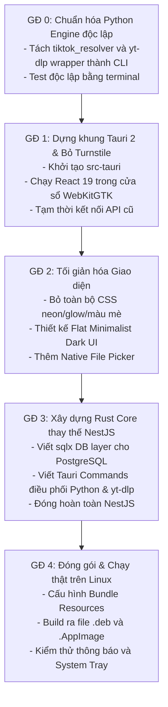

# Kế Hoạch Chuyển Đổi Hệ Thống Sang Linux Desktop App (Tauri 2 + Rust + Python)

> **Dự án**: crwl-on-socialmedia  
> **Tài liệu**: Lộ trình chuyển đổi từ Web App sang Linux Desktop Native Application  
> **Kiến trúc cốt lõi**: Tauri 2.x (WebKitGTK) + Rust (Core & DB) + Python (Crawler Engine) + React 19 (Minimalist UI)  
> **Trạng thái Database**: Giữ nguyên 100% cấu trúc PostgreSQL ([schema.sql](../backend/src/modules/database/schema.sql))

---

## 1. Tổng Quan & Phân Tích Tính Khả Thi

### 1.1. Tại sao chuyển đổi sang Desktop App là bước đi tối ưu?
Hiện tại, ứng dụng web gặp 3 hạn chế cố hữu của một web scraper tập trung:
1. **Nguy cơ IP Blacklist:** Server chạy trên Datacenter/VPS rất dễ bị Cloudflare, TikTok, YouTube phát hiện và chặn IP hoặc bắt giải Captcha. Khi chạy dưới dạng Linux Desktop App, ứng dụng dùng **IP dân cư (Residential IP)** của chính máy tính người dùng, giảm thiểu tối đa rủi ro bị ban.
2. **Tiết kiệm tài nguyên & Băng thông:** Không còn luồng trung gian tải video về server rồi stream lại cho client. Ứng dụng ghi file trực tiếp vào ổ cứng (`~/Downloads` hoặc thư mục do người dùng chọn).
3. **Loại bỏ rào cản Captcha:** Bỏ hoàn toàn cổng Cloudflare Turnstile phiền toái mỗi lần mở app.

### 1.2. Phân chia vai trò công nghệ (Mô hình Tam Giác Vàng)
* **Tauri 2.x (Linux Desktop Shell):** Sử dụng WebKitGTK nhẹ (~30MB - 60MB RAM), hỗ trợ System Tray, Native Notifications, File Dialogs (`rfd`).
* **Rust (Orchestrator & Database Layer):**
  * Xử lý đa luồng bất đồng bộ (`tokio`).
  * Kết nối trực tiếp PostgreSQL thông qua thư viện `sqlx` (an toàn kiểu dữ liệu, hiệu năng cao).
  * Điều phối tiến trình tải, ghi file, quản lý cập nhật nhị phân `yt-dlp` và `ffmpeg`.
* **Python (Extraction Worker / Crawler Engine):**
  * Chịu trách nhiệm bóc tách các nền tảng khó (như TikTok `curl_cffi`, YouTube signature cipher).
  * Giao tiếp với Rust qua cơ chế **Sidecar Subprocess** với dữ liệu JSON qua `stdin` / `stdout`. Không làm sập app chính nếu script bóc tách gặp lỗi.
* **Frontend React 19:**
  * Tái sử dụng logic của các components: `SingleDownloader`, `MultiLinkDownloader`, `BulkDownloader`, `CookieManager`, `DownloadHistoryModal`.
  * Thay đổi toàn diện giao diện: Gỡ bỏ hơn 110KB CSS hiệu ứng lòe loẹt, chuyển sang thiết kế **Clean Minimalist Desktop** phong cách phẳng, hiện đại.

---

## 2. Chiến Lược Cơ Sở Dữ Liệu ("Giữ nguyên DB")

Cơ sở dữ liệu PostgreSQL hiện có giữ nguyên cấu trúc 5 bảng trong [schema.sql](../backend/src/modules/database/schema.sql):
1. `users` (Thông tin thiết bị / người dùng local)
2. `jobs` (Các phiên cào dữ liệu)
3. `job_items` (Chi tiết các link trong job)
4. `extracted_medias` (Thông tin chi tiết video/ảnh/audio bóc tách được)
5. `download_history` (Lịch sử tải xuống)

### Cách tích hợp trong Rust với `sqlx`:
```rust
// Kết nối PostgreSQL bằng sqlx trong Rust
use sqlx::postgres::PgPoolOptions;

pub struct AppState {
    pub db: sqlx::PgPool,
}

pub async fn init_db(database_url: &str) -> Result<sqlx::PgPool, sqlx::Error> {
    PgPoolOptions::new()
        .max_connections(5)
        .connect(database_url)
        .await
}
```
* **Môi trường Cloud/Server:** Nếu bạn dùng Postgres trên Supabase, Neon hoặc VPS cá nhân, Desktop App kết nối trực tiếp qua chuỗi `DATABASE_URL`.
* **Khả năng mở rộng Local:** Cấu trúc 5 bảng này hoàn toàn tương thích 1:1 với SQLite nếu sau này bạn muốn hỗ trợ chế độ 100% Offline không cần internet để kết nối database.

---

## 3. Lộ Trình Refactor Từng Giai Đoạn (Phased Roadmap)



### Giai đoạn 0: Tách lõi Python thành CLI Worker độc lập
* **Nhiệm vụ:**
  * Di chuyển các logic bóc tách trong `backend/src/modules/downloader/services` và `backend/bin/tiktok_resolver.py` thành một CLI module (ví dụ: `core/extractor_cli.py`).
  * Input: Nhận tham số URL và options qua CLI arguments hoặc JSON qua `stdin`.
  * Output: In JSON kết quả ra `stdout`.
* **Tiêu chuẩn nghiệm thu:** Chạy lệnh `python3 extractor_cli.py "https://..."` trong terminal trả về JSON thông tin media mà không cần bật NestJS.

### Giai đoạn 1: Tích hợp Tauri 2 vào Frontend & Gỡ Turnstile
* **Nhiệm vụ:**
  * Thêm Tauri v2 CLI vào dự án frontend: `pnpm add -D @tauri-apps/cli`.
  * Khởi tạo `src-tauri` với template Rust.
  * Xóa bỏ component `TurnstileGate.jsx` và logic xác thực Turnstile trong `App.jsx`.
  * Cho phép ứng dụng khởi động thành một cửa sổ Linux Desktop độc lập.

### Giai đoạn 2: Refactor UI (Tối giản - Clean Minimalist)
* **Nhiệm vụ:**
  * Thay thế file `App.css` đồ sộ bằng giao diện phẳng, thanh thoát:
    * Bảng màu tối (Deep Charcoal `#121212`, viền mờ `#27272a`, chữ `#f4f4f5`).
    * Loại bỏ các hiệu ứng viền neon, badge phát sáng lòe loẹt.
  * Bổ sung tính năng desktop:
    * Hộp thoại chọn đường dẫn lưu file (`tauri-plugin-dialog`).
    * Nút bấm "Mở thư mục tải về" khi tiến trình hoàn tất.

### Giai đoạn 3: Viết Rust Core thay thế hoàn toàn NestJS [ĐÃ HOÀN TẤT 100%]
* **Đã hoàn thành:**
  * Dùng `sqlx` kết nối PostgreSQL theo `schema.sql`, đồng bộ toàn bộ 5 bảng (`users`, `jobs`, `job_items`, `extracted_medias`, `download_history`).
  * Ghi nhận bất đồng bộ tự động `record_single_extraction` và `record_profile_crawl` vào DB.
  * Tích hợp bộ giải mã Netscape Cookie Format tự động (hỗ trợ cả header key=val và JSON).
  * Chuyển đổi toàn bộ endpoint REST API thành Tauri Native Commands (`#[tauri::command]`):
    * `extract_media`, `crawl_profile`, `resolve_short_url`.
    * `start_download` (hỗ trợ trimmer `startTime`/`endTime`, `isMute`, `sponsorBlock`).
    * `download_direct_file`, `download_album_batch` (tải ảnh/album trực tiếp chống chặn 403, đóng gói ZIP native).
    * `get_download_history`, `clear_download_history`, `save_platform_cookies`, `get_cookie_status`.
    * `get_system_health`, `get_browsers_list`, `get_binary_status`, `update_ytdlp`, `update_gallery_dl`.
  * **Đã xoá bỏ hoàn toàn thư mục mã nguồn `apps/backend/` và các cấu hình web cũ.**
  * Kiểm thử tự động `scripts/test_desktop_system.py` đạt chuẩn 100%.

### Giai đoạn 4: Đóng gói và Phân phối Linux
* **Nhiệm vụ:**
  * Cấu hình `tauri.conf.json` để đóng gói kèm binary `yt-dlp`, `ffmpeg`, và Python virtualenv vào mục `resources`.
  * Biên dịch ra các định dạng phân phối chính thức cho Linux:
    * **AppImage**: Định dạng chạy trực tiếp không cần cài đặt trên mọi distro.
    * **Debian Package (.deb)**: Cài đặt tiêu chuẩn trên Ubuntu / Debian / Linux Mint.

---

## 4. Hướng Dẫn Cài Đặt Môi Trường Mới Nhất Trên Ubuntu 26.04

#đã cài xong môi trường 

## 5. Hướng Dẫn Đóng Gói & Chạy Thật Trên Linux

### 5.1. Cấu hình đóng gói (`src-tauri/tauri.conf.json`)
```json
{
  "bundle": {
    "active": true,
    "targets": ["appimage", "deb"],
    "icon": [
      "icons/32x32.png",
      "icons/128x128.png",
      "icons/icon.png"
    ],
    "resources": [
      "bin/yt-dlp",
      "bin/ffmpeg",
      "core/**"
    ]
  }
}
```

### 5.2. Lệnh Build Bản Release
```bash
# Biên dịch toàn bộ frontend và mã nguồn Rust sang native binary
pnpm tauri build
```

Sau khi hoàn thành, file thành phẩm sẽ nằm tại:
* **AppImage:** `apps/frontend/src-tauri/target/release/bundle/appimage/*.AppImage`
* **Deb:** `apps/frontend/src-tauri/target/release/bundle/deb/*_amd64.deb`

### 5.3. Cách Chạy Thật
* **Với AppImage:**
  ```bash
  chmod +x target/release/bundle/appimage/*.AppImage
  ./target/release/bundle/appimage/*.AppImage
  ```
* **Với file DEB:**
  ```bash
  sudo dpkg -i target/release/bundle/deb/*_amd64.deb
  # Ứng dụng sẽ xuất hiện trực tiếp trong App Menu của hệ điều hành
  ```
