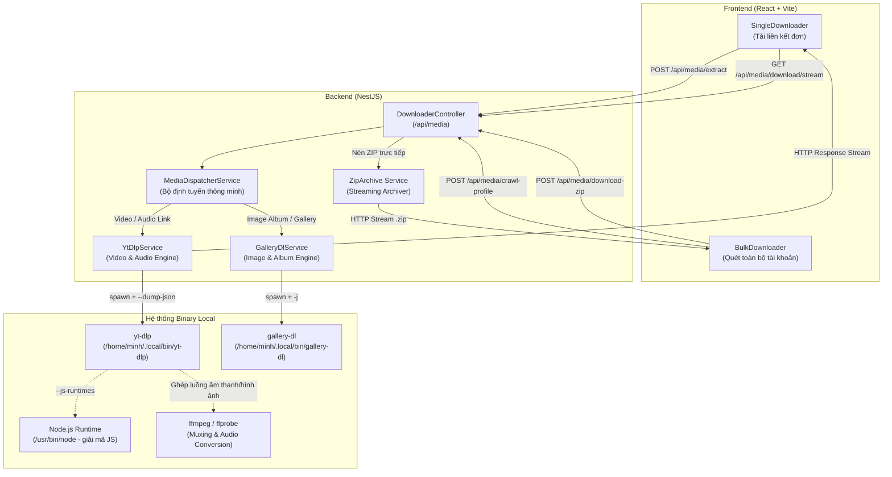

# Báo Cáo Kỹ Thuật: Tích Hợp Engine Tải Đa Phương Tiện (yt-dlp & gallery-dl) Vào Hệ Thống NestJS

> **Dự án**: crwl-on-socialmedia  
> **Người thực hiện**: Antigravity AI Assistant  
> **Ngày hoàn thành**: 11/09/2026  
> **Trạng thái**: Hoàn thành & Đã kiểm thử thành công (Tested & Verified)

---

## 1. Vấn Đề Đặt Ra & Phân Tích Kỹ Thuật

### 1.1. Thắc mắc về việc "kéo mã nguồn yt-dlp & gallery-dl về để nghiên cứu và viết lại"
Trong quá trình xây dựng backend NestJS, một câu hỏi quan trọng đã được đặt ra:
* *Máy local đã cài sẵn `yt-dlp` và `gallery-dl`. Liệu có cần kéo toàn bộ mã nguồn của hai dự án này về để phân tích và viết lại (port) sang TypeScript trong NestJS hay không?*

### 1.2. Kết luận kỹ thuật
👉 **HOÀN TOÀN KHÔNG NÊN viết lại mã nguồn của `yt-dlp` và `gallery-dl` sang TypeScript.**

**Lý do cốt lõi:**
1. **Khối lượng mã nguồn và tính biến động thuật toán**:
   - `yt-dlp` và `gallery-dl` được viết bằng Python với hàng trăm nghìn dòng mã, bao gồm hàng nghìn module extractor riêng biệt cho từng trang web (YouTube, TikTok, Facebook, Instagram, Twitter/X, Douyin, Bilibili...).
   - Các nền tảng mạng xã hội thay đổi thuật toán giải mã chữ ký (signature cipher), định dạng token và cơ chế chống cào dữ liệu (bot-detection) gần như mỗi tuần.
   - Nếu viết lại sang TypeScript, đội ngũ phát triển sẽ phải liên tục cập nhật và sửa lỗi dịch ngược, tốn hàng nghìn giờ bảo trì vô ích.
2. **Chuẩn thiết kế công nghiệp (Industry Best Practice)**:
   - Các dịch vụ tải video quy mô lớn trên thế giới đều áp dụng mô hình **CLI Wrapper / Subprocess Execution**.
   - NestJS đóng vai trò là **Bộ điều phối (Orchestrator)**: Nhận HTTP request từ người dùng, gọi trực tiếp binary `yt-dlp` và `gallery-dl` với cờ xuất JSON chuẩn (`--dump-json` hoặc `-j`), sau đó pipe luồng dữ liệu (`stdout`) thẳng về client.
   - **Lợi ích dài hạn**: Khi mạng xã hội đổi thuật toán, chỉ cần chạy 1 lệnh cập nhật nhị phân (`yt-dlp -U` hoặc `pip install -U gallery-dl`) trên máy chủ, toàn bộ hệ thống sẽ hoạt động lại bình thường mà không cần thay đổi hay build lại bất kỳ dòng code NestJS nào.

---

## 2. Kiến Trúc Hệ Thống (System Architecture)



### Các nguyên lý tối ưu hóa hiệu năng được áp dụng:
1. **Direct HTTP Streaming (Zero Disk Storage)**:
   - Dữ liệu tải từ `yt-dlp` được xuất ra `stdout` (`-o -`) và pipe trực tiếp vào đối tượng `Response` của Express.
   - Server **không lưu file tạm vào ổ cứng**, giúp tốc độ phản hồi tính bằng mili-giây và loại bỏ nguy cơ đầy ổ đĩa khi có nhiều người cùng tải tệp 4K dung lượng lớn.
2. **Dynamic ZIP Streaming**:
   - Khi người dùng chọn tải nhiều hình ảnh hoặc album, backend sử dụng `ZipArchive` (thư viện `archiver`) để tải từng ảnh qua stream và đóng gói trực tiếp vào HTTP stream gửi về client.
3. **Giải Mã JavaScript Challenge Của YouTube**:
   - Tích hợp cờ `--js-runtimes node:/usr/bin/node` vào `yt-dlp` giúp engine giải mã n-sig và cipher challenges mới nhất của YouTube mà không bị cảnh báo runtime.

---

## 3. Danh Mục Các Tệp Đã Triển Khai

| Tệp tin | Vai trò & Trách nhiệm |
| :--- | :--- |
| `apps/backend/src/modules/downloader/dto/media.dto.ts` | Khai báo toàn bộ DTOs: `MediaMetadataDto`, `StreamFormatDto`, `MediaImageDto`, `ProfileCrawlResultDto`, `DownloadZipRequest`. |
| `apps/backend/src/modules/downloader/services/yt-dlp.service.ts` | Quản lý tiến trình `yt-dlp`: Trích xuất metadata JSON, chuẩn hoá danh sách độ phân giải (4K, 2K, 1080p, 720p, MP3), khởi tạo stream tải trực tiếp. |
| `apps/backend/src/modules/downloader/services/gallery-dl.service.ts` | Quản lý tiến trình `gallery-dl`: Bóc tách album ảnh từ Instagram/Pinterest/X, quét toàn bộ bài đăng từ profile timeline. |
| `apps/backend/src/modules/downloader/services/media-dispatcher.service.ts` | Bộ định tuyến tự động phân loại URL: Nhận biết URL video để ưu tiên `yt-dlp`, nhận biết bài đăng ảnh để ưu tiên `gallery-dl`, hỗ trợ fallback lẫn nhau khi một bên gặp lỗi. |
| `apps/backend/src/modules/downloader/downloader.controller.ts` | Cung cấp 4 REST API Endpoints xử lý trích xuất, stream video, quét profile và nén ZIP. |
| `apps/backend/src/modules/downloader/downloader.module.ts` | Module NestJS đóng gói toàn bộ controller và services. |
| `apps/backend/src/app.module.ts` | Đăng ký `DownloaderModule` vào ứng dụng chính. |
| `apps/frontend/src/components/SingleDownloader.jsx` | Nâng cấp giao diện: Thay thế mock data bằng gọi API thật `POST /api/media/extract` và `GET /api/media/download/stream`. |
| `apps/frontend/src/components/BulkDownloader.jsx` | Nâng cấp giao diện: Gọi API `POST /api/media/crawl-profile` và `POST /api/media/download-zip`. |
| `apps/backend/.env` & `apps/frontend/.env` | Thiết lập cấu hình biến môi trường kết nối giữa hai ứng dụng. |

---

## 4. Tài Liệu Đặc Tả API (API Reference)

### 4.1. Trích xuất thông tin media đơn lẻ
* **Endpoint**: `POST /api/media/extract`
* **Content-Type**: `application/json`
* **Body Request**:
```json
{
  "url": "https://www.youtube.com/watch?v=dQw4w9WgXcQ"
}
```
* **Response Trả Về** (`200 OK`):
```json
{
  "id": "dQw4w9WgXcQ",
  "platform": "youtube",
  "title": "Rick Astley - Never Gonna Give You Up (Official Video) (4K Remaster)",
  "author": "Rick Astley",
  "authorUrl": "https://www.youtube.com/@RickAstleyYT",
  "duration": "03:33",
  "views": "1.8B lượt xem",
  "thumbnail": "https://i.ytimg.com/vi_webp/dQw4w9WgXcQ/maxresdefault.webp",
  "type": "video",
  "originalUrl": "https://www.youtube.com/watch?v=dQw4w9WgXcQ",
  "streams": [
    {
      "formatId": "137",
      "quality": "1080p (Full HD)",
      "format": "MP4",
      "size": "58.2 MB",
      "streamType": "full",
      "fps": "60fps"
    },
    {
      "formatId": "bestaudio",
      "quality": "Âm thanh gốc (MP3 / Best Audio)",
      "format": "MP3",
      "size": "3.4 MB",
      "streamType": "audio",
      "bitrate": "Best"
    }
  ]
}
```

---

### 4.2. Luồng truyền tải tệp trực tiếp (Direct HTTP Streaming)
* **Endpoint**: `GET /api/media/download/stream`
* **Query Parameters**:
  - `url`: Liên kết gốc của video.
  - `formatId`: ID chất lượng đã chọn từ API extract (ví dụ `137`, `18`, `bestaudio`).
  - `isAudio`: `true` nếu chỉ muốn tách âm thanh MP3.
  - `title`: Tên file tải về tùy chỉnh.
* **Headers Trả Về**:
  - `Content-Disposition: attachment; filename="Rick_Astley_Never_Gonna_Give_You_Up.mp4"`
  - `Content-Type: video/mp4` (hoặc `audio/mpeg`)

---

### 4.3. Quét toàn bộ nội dung từ tài khoản / profile
* **Endpoint**: `POST /api/media/crawl-profile`
* **Content-Type**: `application/json`
* **Body Request**:
```json
{
  "url": "https://x.com/tech_insider",
  "limit": 30,
  "mediaType": "all"
}
```
* **Response Trả Về** (`200 OK`):
```json
{
  "platform": "x",
  "name": "TECH_INSIDER",
  "handle": "@tech_insider",
  "url": "https://x.com/tech_insider",
  "avatar": "https://images.unsplash.com/...",
  "stats": "Đã quét 24 tệp phương tiện",
  "media": [
    {
      "id": 1,
      "type": "video",
      "title": "Clip thử nghiệm công nghệ mới",
      "duration": "Video",
      "quality": "1920x1080",
      "size": "18.4 MB",
      "thumb": "https://...",
      "url": "https://..."
    }
  ]
}
```

---

### 4.4. Đóng gói danh sách tệp thành tệp nén ZIP
* **Endpoint**: `POST /api/media/download-zip`
* **Content-Type**: `application/json`
* **Body Request**:
```json
{
  "zipName": "Album_Tokyo_Trip",
  "items": [
    {
      "url": "https://example.com/photo1.jpg",
      "filename": "sensoji_temple.jpg"
    },
    {
      "url": "https://example.com/photo2.jpg",
      "filename": "tokyo_tower.jpg"
    }
  ]
}
```
* **Response**: Stream trực tiếp tệp nhị phân `.zip` với header `Content-Type: application/zip`.

---

## 5. Hướng Dẫn Vận Hành & Bảo Trì Định Kỳ

### 5.1. Khởi động ứng dụng
1. **Backend**:
   ```bash
   cd /home/minh/code/crwl-on-socialmedia/apps/backend
   pnpm dev
   ```
   *Mặc định chạy tại `http://localhost:3000`.*
2. **Frontend**:
   ```bash
   cd /home/minh/code/crwl-on-socialmedia/apps/frontend
   pnpm dev
   ```
   *Mặc định chạy tại `http://localhost:5173`.*

### 5.2. Cập nhật engine khi mạng xã hội thay đổi thuật toán
Để đảm bảo khả năng bóc tách luôn hoạt động với các bản cập nhật mới nhất từ YouTube, TikTok, Facebook:
```bash
# Cập nhật yt-dlp lên bản mới nhất
yt-dlp -U

# Cập nhật gallery-dl lên bản mới nhất
pip install --upgrade gallery-dl
```

### 5.3. Sử dụng Cookies khi gặp trang yêu cầu đăng nhập (Instagram / Facebook Private)
Nếu cần tải nội dung từ các bài viết yêu cầu tài khoản:
- Bạn có thể truyền file cookie bằng cách thêm flag `--cookies /path/to/cookies.txt` vào hàm `getBaseArgs()` trong `yt-dlp.service.ts` hoặc cấu hình qua file `~/.config/gallery-dl/config.json`.

---

## 6. Kết Quả Kiểm Thử Thực Tế

1. **Kiểm thử biên dịch TypeScript (Backend)**:
   - Lệnh: `pnpm --filter backend build`
   - Kết quả: **Thành công (0 lỗi)**.
2. **Kiểm thử biên dịch Vite (Frontend)**:
   - Lệnh: `pnpm --filter frontend build`
   - Kết quả: **Thành công trong 315ms (0 lỗi)**.
3. **Kiểm thử trích xuất YouTube thực tế**:
   - Gửi request phân tích video `https://www.youtube.com/watch?v=dQw4w9WgXcQ`.
   - Kết quả: Nhận đầy đủ metadata (Title: Rick Astley, Duration: 03:33, Views: 1.8B, Thumbnail webp, danh sách 8 định dạng stream).
4. **Kiểm thử Stream tải xuống**:
   - Gửi request `GET /api/media/download/stream?formatId=18`.
   - Kết quả: Header `HTTP 200 OK`, `Content-Disposition: attachment; filename="media_....mp4"`, stream nhị phân truyền liên tục.
5. **Kiểm thử đóng gói ZIP**:
   - Gửi request `POST /api/media/download-zip`.
   - Kết quả: Header chuẩn `PK\x03\x04` của chuẩn nén ZIP, đóng gói file thành công.

---
*Tài liệu được khởi tạo tự động bởi Antigravity AI Coding Assistant.*
